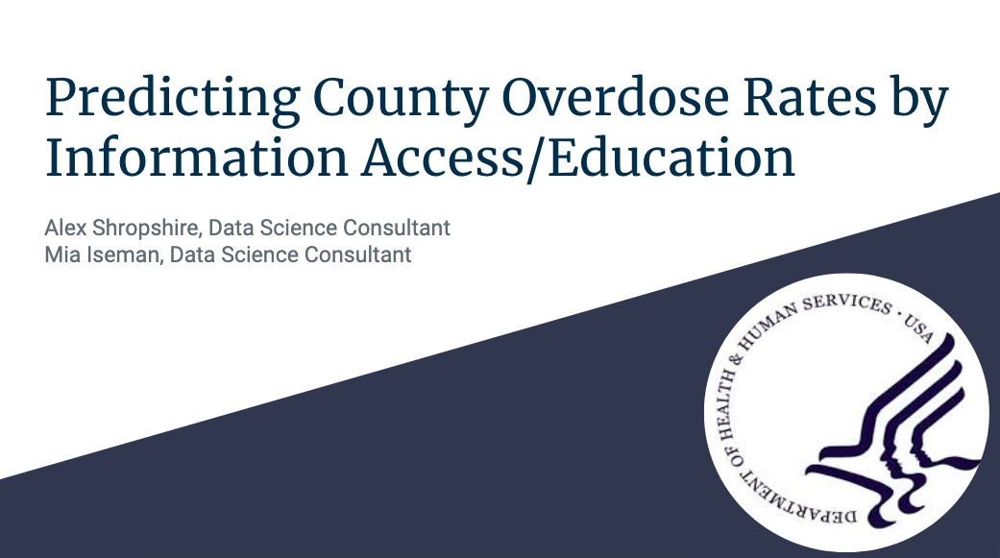
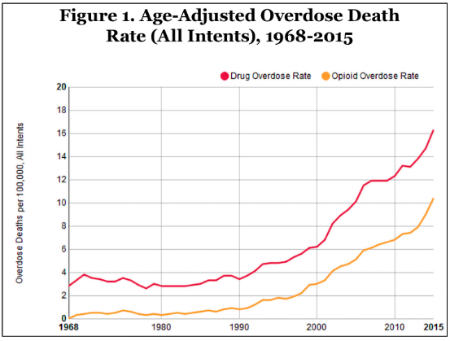
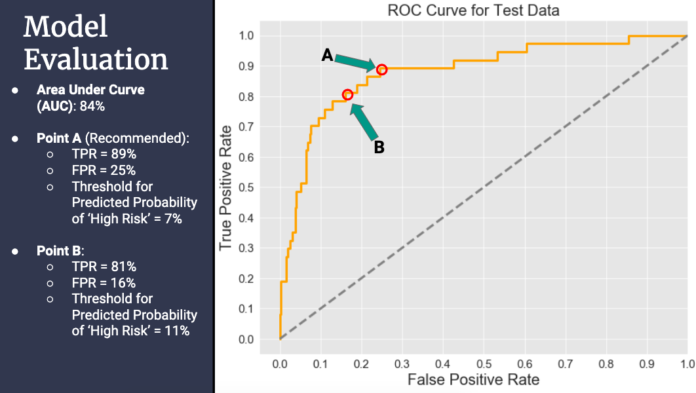
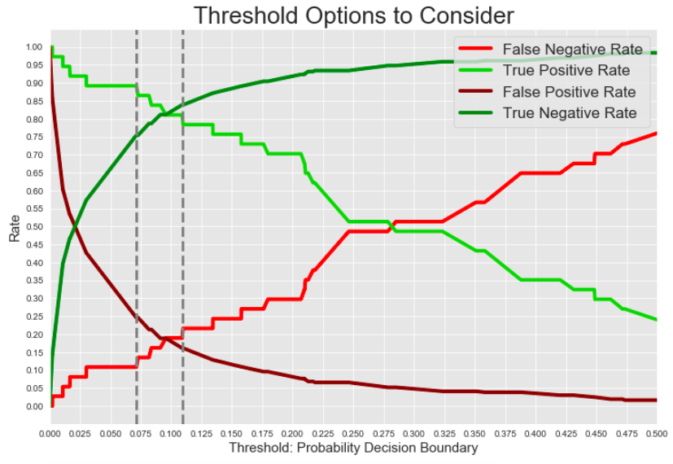

  

This is a case study by Mia Iseman & Alex Shropshire. U.S. Health and Human Services is not involved in our study, though the study was conducted with actual and relevant data.

# Goal: Identify which U.S. counties are at risk of having a very high overdose fatality rate based on factors related to education and internet connectivity.

## Overview of Our Process
- Understand the relevance of the opioid epidemic and relevance of this assessment
- Understand where the data came from and its defintions
- Prepare the data for analysis and modeling
- Create models to predict and classify the county overdose rates 
- Evaluate the results to choose and refine the best model 
- Deliver the model's insights, actionable recommendations, and possible next steps

## Relevance & Context
The U.S. Department of Health and Human Services has a number of partnerships with businesses and other governmental agencies to address public health concerns. One such partnership could be related to prevention of oversdoses, since we are in the middle of an opioid epidemic.   

 
      
<i> Source: The Numbers Behind the Opioid Crisis, Vice Chairman’s Staff of the Joint Economic Committee, Nov 2017   </i> 

  

Before U.S Health & Human Services can prevent overdoses, they need to see if and where a program could be effectively implemented. They must do their due diligence to discover factors corresponding with an overdose fatality. As part of this research, we investigate the relationship between overdose fatality rates at the county level based on county education and internet connectivity data. 

We will deliver a model that predicts whether a county will have a high overdose rate or not, to bring more attention to those counties that are at risk of having the highest overdose rates in the country. The relationship between educational attainment, internet connectivity, and overdose rates may not be immediately obvious, but part of this approach involves understanding if an underlying relationship exists. Part of tackling the problem at hand means focusing on prevention, and making strides in prevention means finding non-obvious, controllable factors that could improve the situation. Though correlation does not equate to causation, the results of this model in conjunction with additional information from several other investigations and efforts can help determine the best course of action in overdose prevention programming at a local level.

## Understand the Data
"High" or "low" fatal overdose rate is our target feature. Education/internet connectivity may predict our target, but these factors don't cause our target. This is another reason that this model and research should be taken with regard to several other datasets and models in order to understand the best way to predict AND prevent overdoses by county.

We constructed our target from the Center for Disease Control's Wonder, a database querying tool. We constructed our features from the U.S. Census American Community Survey 5-year 2013-2017 survey.

Facts about our target variable, the Crude Death Rate:

- Deaths are tracked from 2013-2017
- Grouped by U.S. County and U.S. States
- Crude Rate represents Drug and Alcohol-related fatalities per 100,000 people
- Some counties had suppressed or unreliable data.

## Prepare the Data
1. Retrieve and prep the Census data (features) using Cenpy, a python API wrapper to query the US Census API and load in Pandas Dataframes.
2. In order to know which variables serve our business needs, we're looking at <a href="https://api.census.gov/data/2017/acs/acs5/profile/variables.html">this reference</a> and the "search" feature.
3. Retrieve and prepare the CDC data (target). This means classifying counties with Crude Rates >=48 deaths per 100K people as "High."
4. Join the target with the features. To label our data for our classification task, we need to join the two tables. We join them on the county code, which is a combination of the state and county in the case of the Census features
5. Investigate the data further, and clean it for modeling purposes.

## Model
1. Split our data into training and test sets.
2. Fit a Logistic Regression on the train set and evaluate predictions.
3. Engineer the 'state' feature with one hot encoding, bringing in a geographical element.
4. Split our encoded data.
5. Once again, fit encoded data with Logistic Regression.
6. Fit encoded data using Random Forest Classificatin.
7. Identify the best parameters to use in Random Forest with GridSearch.

## Evaluate the Models
Logistic Regression on our encoded data gave us the highest AUC score, so we  use that as best our model for final evaluation. 

It's clear from this graph that there are several decision thresholds that available to stakeholders. Is it better to capture more truly high risk counties (true positives) even though you get more actually low risk counties included in that data (falst positives)? We argue that it is, and that point A is a good cutoff. This means that any county whose probability of being high risk was 7% or higher would be included in the "high risk" category.   

Here is another way to visualize the decision thresholds:

  

We looked at the regression coefficients (log odds) to assess feature impact in order to rank the impact that each feature has on our predictions. This helped us identify what states and what educational/connectivity-related features affected the results of the model the most. Regularization helps lessen the effect of less impactful features and those similar to other features to reduce the possibility of an overfit model.

## Deployment
When we first set out to perform this assessment, we thought it would be interesting to see the relationship between "controllable" factors such as the features seen here as opposed to features like race, sex, etc. which are less controllable by the government. However, there is no good reason not to include them in the modeling process, so we recommend using most features to improve the model, even if they end up being "inactionable" in terms of the program in the future.

We recommend spending more time to see if there are other models that perform better than the ones we built in the time available to us.

After the Health and Human Services Department decides on what thresholds suit their causes best, we recommend combining this data with a other features and reports to ensure they are make well-informed decisions around the very serious opioid epidemic. 

